# ⛱️ LeisureUp

### 지루한 일상 속, 레저 여행으로 즐거움을 더해보세요!

#### 레저 탐색부터 일정 관리까지, 즐거운 순간을 더 가볍고 편리게 만들어주는 레저-여행 플랫폼입니다.

    
    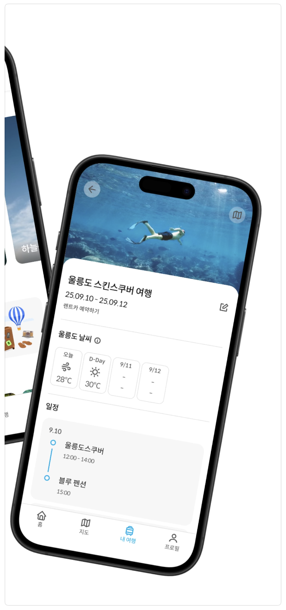

> [2025 관광데이터 활용 공모전](https://www.2025tourapi.com/) 참가작
>
> - [앱스토어 링크](https://apps.apple.com/kr/app/%EB%A0%88%EC%A0%80%EC%97%85/id6751452132)
>
> 프로젝트 인원 : 디자인 1, 프론트 2, 백엔드 2
>
> 프로젝트 기간 : 2025.06 ~ 2025.09

## 주 서비스

### 1️⃣ 나만의 취향에 맞는 레저 찾기

**나에게 맞는 레저를 추천받아 보세요.**

    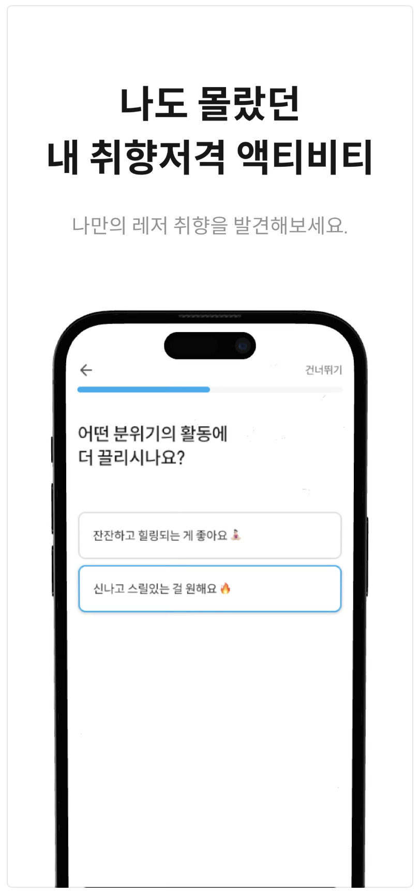
    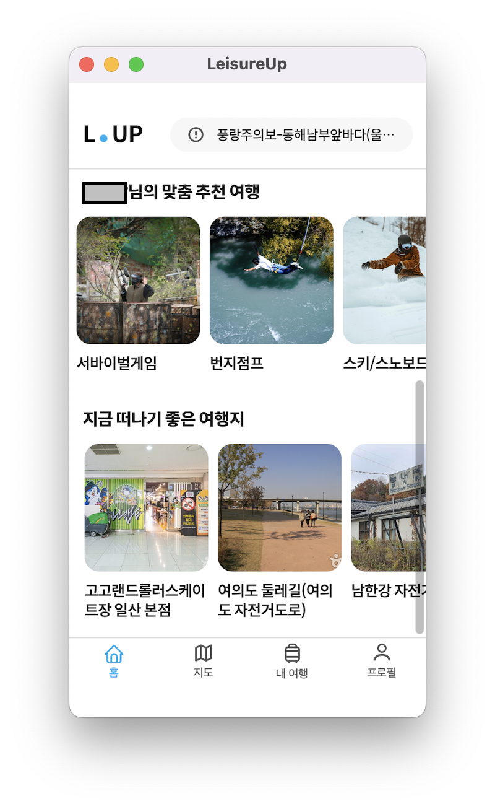

사용자 취향에 맞는 레저 종류와 계절에 적합한 여행지를 추천받을 수 있습니다.

### 2️⃣ 지도로 한눈에 보는 즐길 거리

**내 위치 주변의 레저 장소, 맛집, 숙소, 병원까지 한 번에 찾아보세요.**

    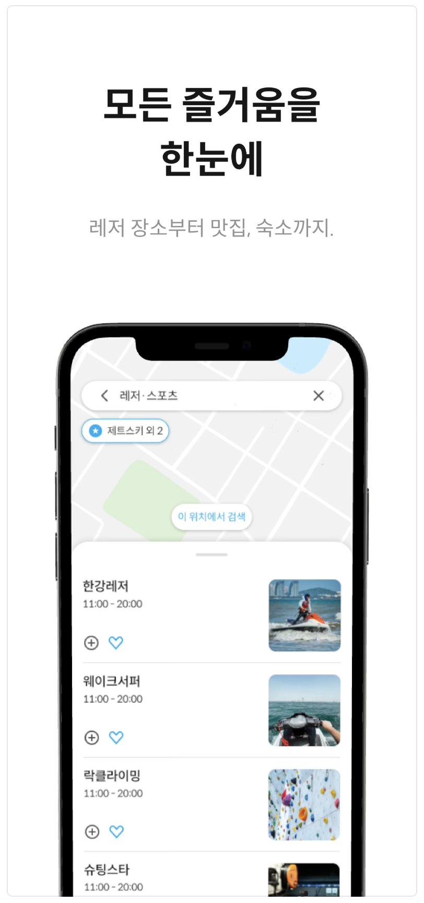

필터와 키워드 검색으로 원하는 장소를 빠르게 탐색할 수 있습니다.

지도를 움직이며 다른 지역도 자유롭게 탐색할 수 있고, 관심 장소를 설정해 여행 계획에 추가할 수 있습니다.

### 3️⃣ 여행 계획, 이제는 간단하게

**관심 장소들을 모아 나만의 여행 일정을 만들어 보세요.**

    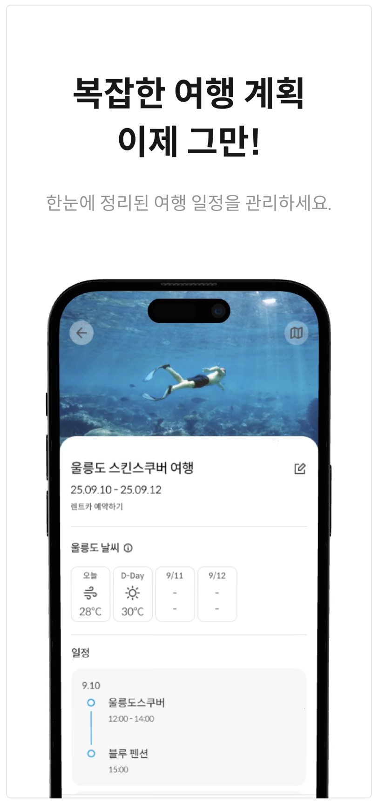
    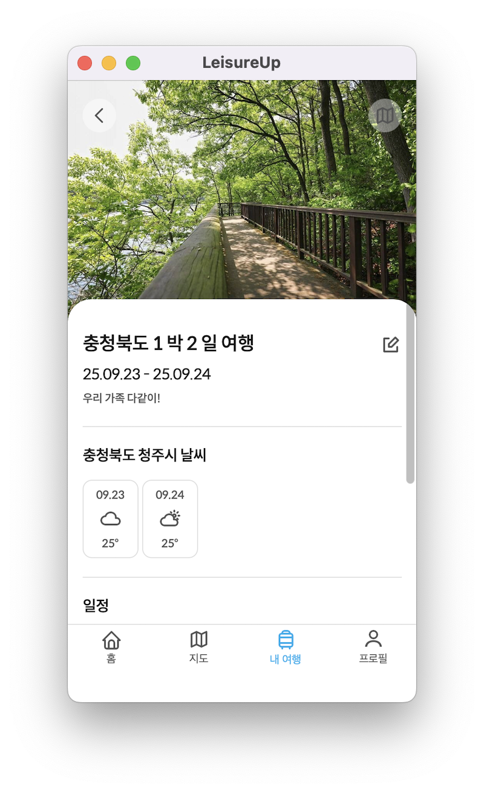
    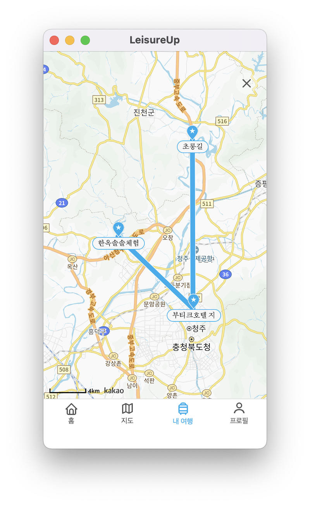

여행 이름과 날짜를 지정해 탐방 계획을 만들 수 있습니다.

여행지 날씨 정보까지 함께 제공되어 더 스마트한 여행을 즐겨 보세요.

---

## 활용 기술

### 💡Tech

- #### Framework

![spring-modulith-logo](https://img.shields.io/badge/spring_modulith-%236DB33F.svg?style=for-the-badge&logo=data:image/svg%2bxml;base64,PD94bWwgdmVyc2lvbj0iMS4wIiBlbmNvZGluZz0idXRmLTgiPz4KPCEtLSBHZW5lcmF0b3I6IEFkb2JlIElsbHVzdHJhdG9yIDI4LjAuMCwgU1ZHIEV4cG9ydCBQbHVnLUluIC4gU1ZHIFZlcnNpb246IDYuMDAgQnVpbGQgMCkgIC0tPgo8c3ZnIHZlcnNpb249IjEuMSIgaWQ9IkxheWVyXzEiIHhtbG5zPSJodHRwOi8vd3d3LnczLm9yZy8yMDAwL3N2ZyIgeG1sbnM6eGxpbms9Imh0dHA6Ly93d3cudzMub3JnLzE5OTkveGxpbmsiIHg9IjBweCIgeT0iMHB4IgoJIHZpZXdCb3g9IjAgMCA2MDAgNjAwIiBzdHlsZT0iZW5hYmxlLWJhY2tncm91bmQ6bmV3IDAgMCA2MDAgNjAwOyIgeG1sOnNwYWNlPSJwcmVzZXJ2ZSI+CjxzdHlsZSB0eXBlPSJ0ZXh0L2NzcyI+Cgkuc3Qwe2ZpbGw6I0ZGRkZGRjt9Cgkuc3Qxe2ZpbGw6bm9uZTtzdHJva2U6Izc4QkUyMDtzdHJva2Utd2lkdGg6MTIuMTQyOTtzdHJva2UtbWl0ZXJsaW1pdDoxMDt9Cgkuc3Qye2ZpbGw6bm9uZTtzdHJva2U6Izc4QkUyMDtzdHJva2Utd2lkdGg6MjQuMjg1OTtzdHJva2UtbWl0ZXJsaW1pdDoxMDt9Cgkuc3Qze2ZpbGw6I0ZGRkZGRjt9Cgkuc3Q0e2ZpbGw6Izc4QkUyMDtzdHJva2U6I0ZGRkZGRjtzdHJva2Utd2lkdGg6MTEuNzQ3NjtzdHJva2UtbWl0ZXJsaW1pdDoxMDt9Cjwvc3R5bGU+CjxnPgoJPGc+CgkJPHBhdGggY2xhc3M9InN0MCIgZD0iTTMwMCwzLjA4TDQyLjg2LDE1MS41NHYyOTYuOTJMMzAwLDU5Ni45MmwyNTcuMTQtMTQ4LjQ2VjE1MS41NEwzMDAsMy4wOHogTTMwMCwzMS4xM2wyMjcuNTcsMTMxLjM4CgkJCWwtNjAuOSwzNi4xM0wzMDAsMTAyLjQxbC0xNjQuNDgsOTQuOTdsLTYwLjktMzYuMTNMMzAwLDMxLjEzeiBNNDMwLjk0LDMwOC42OHY2OC45MWwtNTkuNjksMzQuNDZsLTU5LjY4LTM0LjQ2di02OC45MQoJCQlsNTkuNjgtMzQuNDZMNDMwLjk0LDMwOC42OHogTTIyOC43NCwyNzQuMjJsNTkuNjksMzQuNDZ2NjguOTFsLTU5LjY5LDM0LjQ2bC01OS42OC0zNC40NnYtNjguOTFMMjI4Ljc0LDI3NC4yMnogTTI5My44LDU2NS4zCgkJCUw2Ny4xNSw0MzQuNDR2LTI2My41bDYxLjczLDM2LjYyVjM5OC44TDI5NCw0OTQuMTNMMjkzLjgsNTY1LjN6IE0yNDAuMzEsMjU0LjAzdi02OC45MUwzMDAsMTUwLjY2bDU5LjY4LDM0LjQ2djY4LjkxTDMwMCwyODguNDkKCQkJTDI0MC4zMSwyNTQuMDN6IE01MzIuODUsNDM0LjQ0TDMwNS45NCw1NjUuNDVsMC4yMS03MS40MWwxNjQuOTctOTUuMjRWMjEwLjEybDYxLjczLTM2LjYyVjQzNC40NHoiLz4KCTwvZz4KCTxnPgoJCTxnPgoJCQk8Zz4KCQkJCTxwb2x5Z29uIGNsYXNzPSJzdDAiIHBvaW50cz0iMzQ3Ljk0LDE5OS43MyAzNDcuOTQsMjQ3LjI1IDMwMCwyNzQuOTMgMjUyLjA2LDI0Ny4yNSAyNTIuMDYsMjAwLjE4IDMwMC4zNywyMjguNDcgCQkJCSIvPgoJCQkJPHBvbHlnb24gY2xhc3M9InN0MCIgcG9pbnRzPSIzNDIuOTUsMTg5LjAyIDMwMC4yOCwyMTQuOCAyNTYuNjQsMTg5LjI1IDMwMCwxNjQuMjIgCQkJCSIvPgoJCQk8L2c+CgkJPC9nPgoJPC9nPgoJPGc+CgkJPGc+CgkJCTxnPgoJCQkJPGc+CgkJCQkJPHBvbHlnb24gY2xhc3M9InN0MCIgcG9pbnRzPSIyNzEuNjksMzEyLjU4IDIyOS4wMiwzMzguMzYgMTg1LjM5LDMxMi44MSAyMjguNzQsMjg3Ljc4IAkJCQkJIi8+CgkJCQkJPHBvbHlnb24gY2xhc3M9InN0MCIgcG9pbnRzPSIyNzYuNjgsMzIzLjMgMjc2LjY4LDM3MC44MSAyMjguNzQsMzk4LjQ5IDE4MC44MSwzNzAuODEgMTgwLjgxLDMyMy43NSAyMjkuMTIsMzUyLjAzIAkJCQkJIi8+CgkJCQk8L2c+CgkJCTwvZz4KCQk8L2c+CgkJPGc+CgkJCTxnPgoJCQkJPGc+CgkJCQkJPHBvbHlnb24gY2xhc3M9InN0MCIgcG9pbnRzPSI0MTkuMTksMzIzLjMgNDE5LjE5LDM3MC44MSAzNzEuMjUsMzk4LjQ5IDMyMy4zMiwzNzAuODEgMzIzLjMyLDMyMy43NSAzNzEuNjMsMzUyLjAzIAkJCQkJIi8+CgkJCQkJPHBvbHlnb24gY2xhc3M9InN0MCIgcG9pbnRzPSI0MTQuMiwzMTIuNTggMzcxLjUzLDMzOC4zNiAzMjcuOSwzMTIuODEgMzcxLjI1LDI4Ny43OCAJCQkJCSIvPgoJCQkJPC9nPgoJCQk8L2c+CgkJPC9nPgoJPC9nPgo8L2c+Cjwvc3ZnPgo=)
![spring-data-jpa-logo](https://img.shields.io/badge/spring_data_jpa-%236DB33F.svg?style=for-the-badge&logo=data:image/svg%2bxml;base64,PHN2ZyBpZD0iTGF5ZXJfMSIgZGF0YS1uYW1lPSJMYXllciAxIiB4bWxucz0iaHR0cDovL3d3dy53My5vcmcvMjAwMC9zdmciIHZpZXdCb3g9IjAgMCAxMTYuODggMTQ1Ljk3Ij48ZGVmcz48c3R5bGU+LmNscy0xe2ZpbGw6I0ZGRkZGRjt9PC9zdHlsZT48L2RlZnM+PHRpdGxlPmxvZ28tZGF0YTwvdGl0bGU+PHBhdGggY2xhc3M9ImNscy0xIiBkPSJNNTguMzMsMTAxLjc5QzI5LjU0LDEwMS43OSwxNyw5OS40MiwwLDk1LjQ2djQ0bC44LjJjMTYuNCw0LDI4LjgsNi4zMiw1Ny41Myw2LjMyczQxLjM1LTIuMzgsNTcuNzQtNi4zN2wuODEtLjJ2LTQ0Qzk5LjkzLDk5LjQsODcuMjcsMTAxLjc5LDU4LjMzLDEwMS43OVoiLz48cGF0aCBjbGFzcz0iY2xzLTEiIGQ9Ik01OC4zMywwQzI5LjYsMCwxNy4yLDIuMzYuOCw2LjMybC0uOC4yVjUzYzE3LTQsMjkuNTQtNi4zMyw1OC4zMy02LjMzczQxLjYsMi4zOSw1OC41NSw2LjM5VjYuNTdsLS44MS0uMkM5OS42OCwyLjM4LDg3LjIxLDAsNTguMzMsMFoiLz48cGF0aCBjbGFzcz0iY2xzLTEiIGQ9Ik0xMTYuODgsNTUuNThsLS44MS0uMkM5OS42OCw1MS4zOSw4Ny4yMSw0OSw1OC4zMyw0OVMxNy4yLDUxLjM3LjgsNTUuMzJsLS44LjJWOTIuOTRsLjguMTljMTYuNCw0LDI4LjgsNi4zMyw1Ny41Myw2LjMzczQxLjM1LTIuMzksNTcuNzQtNi4zOGwuODEtLjJaIi8+PC9zdmc+&logoColor=white)
![spring-cloud-logo](https://img.shields.io/badge/spring_cloud_openfeign-%236DB33F.svg?style=for-the-badge&logo=data:image/svg%2bxml;base64,PHN2ZyB4bWxucz0iaHR0cDovL3d3dy53My5vcmcvMjAwMC9zdmciIHZpZXdCb3g9IjAgMCAxNTcuOTEgMTA3LjE0Ij48ZGVmcz48c3R5bGU+LmNscy0xe2ZpbGw6I0ZGRkZGRjt9PC9zdHlsZT48L2RlZnM+PHRpdGxlPmljb24tc3ByaW5nLWNsb3VkPC90aXRsZT48ZyBpZD0iTGF5ZXJfMiIgZGF0YS1uYW1lPSJMYXllciAyIj48ZyBpZD0iaWNvbnMiPjxwYXRoIGNsYXNzPSJjbHMtMSIgZD0iTTUyLjc1LDg3LjJhMy4yMSwzLjIxLDAsMSwxLS40Ny00LjUyQTMuMjEsMy4yMSwwLDAsMSw1Mi43NSw4Ny4yWm01MS0xMS4yNUM5NC40NSw4OC4zLDc0LjY2LDg0LjE0LDYyLDg0LjczYzAsMC0yLjI1LjEzLTQuNTIuNSwwLDAsLjg2LS4zNiwxLjk1LS43NEM2OC4zMiw4MS40MSw3Mi41Myw4MC43OSw3OCw3OGMxMC4xNy01LjIxLDIwLjMtMTYuNTYsMjIuMzYtMjguMzZDOTYuNDQsNjEsODQuNjYsNzAuNzUsNzMuOTMsNzQuNzJjLTcuMzQsMi43LTIwLjYyLDUuMzQtMjAuNjIsNS4zNGwtLjU0LS4yOGMtOS00LjM5LTkuMjktMjQsNy4xMS0zMC4yNiw3LjE5LTIuNzYsMTQuMDctMS4yNCwyMS44NC0zLjA5LDguMjktMiwxNy44OS04LjE5LDIxLjgtMTYuMzJDMTA3Ljg5LDQzLjA5LDExMy4xNSw2My4zOSwxMDMuNzIsNzZaIi8+PHBhdGggY2xhc3M9ImNscy0xIiBkPSJNMTIyLjMzLDEwNy4xNEgzOS43OUEzOS43OSwzOS43OSwwLDAsMSwzMy44NiwyOEMzOSwyMC44OCw0NS40MiwxMi44OCw1NC43NCw3LjQyYTU0LjIxLDU0LjIxLDAsMCwxLDYxLjUzLDQuNjlsLjEuMDlhNzcuNDksNzcuNDksMCwwLDEsMTEuNjgsMTIuNTEsMzksMzksMCwwLDEsNi42NCwxMi43NGMuMDkuMzMuMTcuNTIuMjEuNjQuMi4xLjU1LjI1LjgzLjM3bDEuMDcuNDdhMzYuMzcsMzYuMzcsMCwwLDEsMTMuNTcsMTAuNzEsMzUuNTksMzUuNTksMCwwLDEtMjgsNTcuNVpNODIuMDgsOGE0Ni4yMyw0Ni4yMywwLDAsMC0yMy4zLDYuMzJjLTguMDUsNC43Mi0xMy44NiwxMi0xOC40NywxOC40MWwtLjE5LjI4QTUuNjEsNS42MSwwLDAsMSwzNiwzNS43OGEzMS43OSwzMS43OSwwLDAsMCwzLjgsNjMuMzZoODIuNTRhMjcuNTksMjcuNTksMCwwLDAsMjEuNzMtNDQuNTgsMjguNTgsMjguNTgsMCwwLDAtNi41NS02LjEsMjksMjksMCwwLDAtNC0yLjI2bC0uODktLjM5QTEwLjE5LDEwLjE5LDAsMCwxLDEyOS40Nyw0NCw4Ljg5LDguODksMCwwLDEsMTI3LDM5LjYxYTMxLDMxLDAsMCwwLTUuMzctMTAuMTRBNzAsNzAsMCwwLDAsMTExLjIsMTguMyw0Ni4wNSw0Ni4wNSwwLDAsMCw4Mi4wOCw4WiIvPjwvZz48L2c+PC9zdmc+&logoColor=white)

- #### Service

- #### Test

### 🔖 Deploy

---

## 설계 및 문서

### 🧱 인프라 구조

    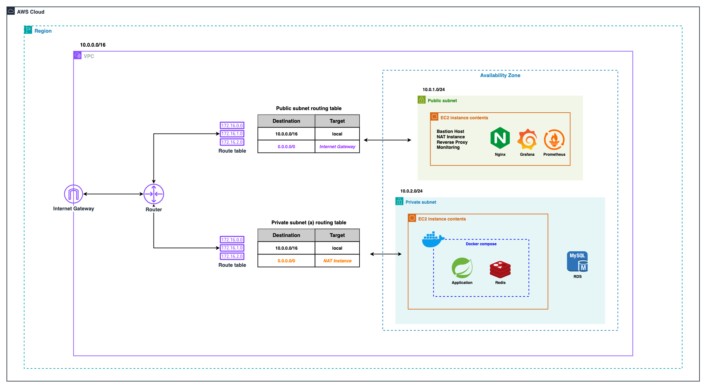

### 🗂️ 컴포넌트 구조

    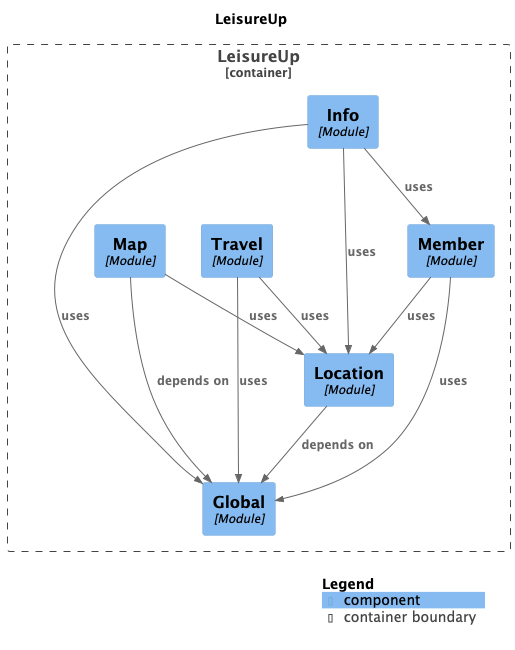

| Module                                               | 담당 역할                                                    |
|------------------------------------------------------|----------------------------------------------------------|
| [`Global`](./src/main/java/org/leisureup/global)     | 요청 인증-인가, 공통 응답 형태 (+Exception handler) 제공, 공통 config 제공 |
| [`Map`](./src/main/java/org/leisureup/map)           | 레저 필터링 및 키워드 지도 검색, 음식점 및 병원 지도 검색                       |
| [`Location`](./src/main/java/org/leisureup/location) | 장소 정보 API fetch 및 동기화 수행, 타 모듈 장소 정보 제공                  |
| [`Member`](./src/main/java/org/leisureup/member)     | 사용자 식별 및 생성, 사용자 정보 조회, 사용자 장소 찜 정보 저장                   |
| [`Travel`](./src/main/java/org/leisureup/travel)     | 사용자 여행 계획 생성 및 수정                                        |
| [`Info`](./src/main/java/org/leisureup/info)         | 사용자 맞춤 레저 여행 추천, 기상 예보 및 경보 조회                           |

### 📑 ERD

- ### [ERD Cloud 링크 (ver 2025.09.22)](https://www.erdcloud.com/d/ShurMNbH93t2EqF3p)

    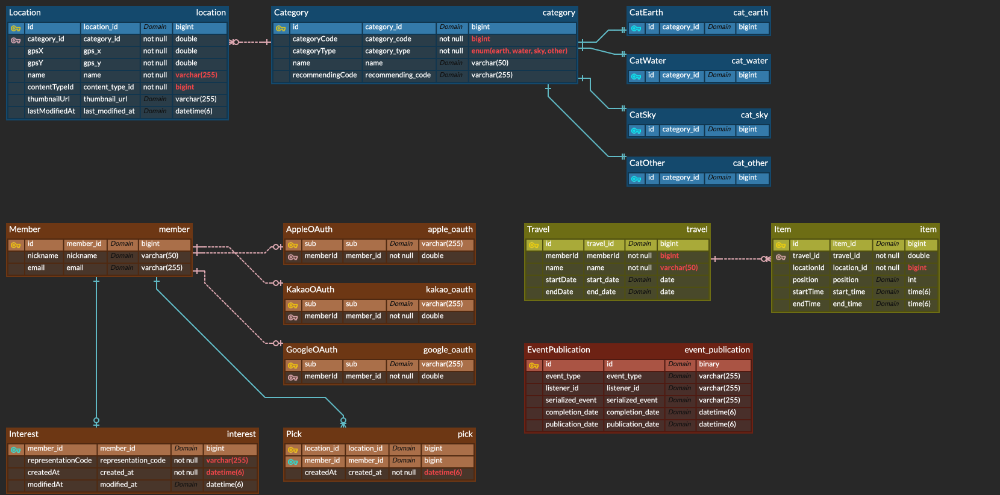

### 📡 API 문서

- ### [Notion 문서 (ver 2025.09.22)](https://www.notion.so/jbw9964/LeisureUp-API-2025-09-22-276646c675c180a0bcfadaac9ee45720?source=copy_link)

---

## 📌 담당 내용

- ### Global

| 기능                   | 설명                                                                                      | 관련 코드                                                                                                                                                                         |
|----------------------|-----------------------------------------------------------------------------------------|-------------------------------------------------------------------------------------------------------------------------------------------------------------------------------|
| OAuth2 + OIDC 사용자 인증 | Google, Kakao 는 OIDC user endpoint 를 이용하였고, Apple 은 ID token 을 검증하는 방식으로 구성하였습니다.       | [`auth.social` package](./src/main/java/org/leisureup/global/auth/social)                                                                                                     |
| JWT 인증, 발급 및 저장      | JJWT 라이브러리를 통해 토큰을 인증, 발급하였으며, Spring Data + Redis 를 이용해 refresh token 을 저장하도록 구성하였습니다. | [`auth.token` 패키지](./src/main/java/org/leisureup/global/auth/token), [`TokenAuthService.java`](./src/main/java/org/leisureup/global/auth/token/service/TokenAuthService.java) |

- ### Map

| 기능        | 설명                                                                                                                   | 관련 코드                                                                                                  |
|-----------|----------------------------------------------------------------------------------------------------------------------|--------------------------------------------------------------------------------------------------------|
| 레저 필터링 검색 | 현 좌표에서 특정 레저 종류를 검색하는 기능을 구성하였습니다. TourAPI 가 단일 종류 검색만 지원하여 `@Async`, `CompletableFuture` 를 이용해 다수 종류 검색을 가능케 하였습니다. | [`LeisureSearchService`](./src/main/java/org/leisureup/map/internal/service/LeisureSearchService.java) |

- ### Location

| 기능                     | 설명                                                                                   | 관련 코드                                                                                                                                                                                                                        |
|------------------------|--------------------------------------------------------------------------------------|------------------------------------------------------------------------------------------------------------------------------------------------------------------------------------------------------------------------------|
| 장소 정보 조회               | 장소 ID 를 통해 정보 조회를 구현하였습니다. 정보가 DB 에 존재하지 않을 시 API 로 정보를 fetch 하고 DB 에 저장하도록 구성하였습니다. | [`LocationService`](./src/main/java/org/leisureup/location/internal/service/LocationService.java), [`LocationFetchService`](./src/main/java/org/leisureup/location/internal/service/LocationFetchService.java)               |
| `DB <---> API` 데이터 동기화 | 저장된 장소 정보가 API 의 것과 동일한지 확인하는 기능입니다. Spring Modulith 를 통해 이벤트 기반으로 구현하였습니다.          | [`DataSyncEventScheduler`](./src/main/java/org/leisureup/location/internal/service/DataSyncEventScheduler.java), [`DataSyncEventHandler`](./src/main/java/org/leisureup/location/internal/service/DataSyncEventHandler.java) |

- ### Member

| 기능        | 설명                                   | 관련 코드                                                                                       |
|-----------|--------------------------------------|---------------------------------------------------------------------------------------------|
| 사용자 관련 기능 | 사용자 정보, 찜 목록, 질의응답 등을 CRUD 구현 하였습니다. | [`MemberService`](./src/main/java/org/leisureup/member/internal/service/MemberService.java) |

- ### Info

| 기능              | 설명                                                                                                           | 관련 코드                                                                                                                                                                                                                    |
|-----------------|--------------------------------------------------------------------------------------------------------------|--------------------------------------------------------------------------------------------------------------------------------------------------------------------------------------------------------------------------|
| 사용자 맞춤 레저 여행 추천 | 사용자 질의응답을 바탕으로 적합한 여행지를 추천하는 기능입니다. 로그인하지 않거나 질의응답 정보가 없을시 랜덤하게 추천하도록 구성했습니다.                                | [`RecommendService`](./src/main/java/org/leisureup/info/recommend/service/RecommendService.java), [`PrioritizingService`](./src/main/java/org/leisureup/info/recommend/service/PrioritizingService.java)                 |
| 기상 예보 및 경보 조회   | 현재 발효된 기상 경보를 조회하고, 특정 좌표에 해당하는 기상 예보를 조회하는 기능입니다. API 응답 시간 단축을 위해 `@Async`, `CompletableFuture` 를 이용하였습니다. | [`WeatherInformService`](./src/main/java/org/leisureup/info/weather/service/WeatherInformService.java), [`ShortTermForecastComposer`](./src/main/java/org/leisureup/info/weather/service/ShortTermForecastComposer.java) |

- ### CI/CD

| 기능       | 설명                                                                                          | 관련 코드                                                                                                                                                                                                            |
|----------|---------------------------------------------------------------------------------------------|------------------------------------------------------------------------------------------------------------------------------------------------------------------------------------------------------------------|
| 복합 액션 구성 | `어플리케이션 빌드`, `테스트/배포에 필요한 profile 생성` 등 파이프라인에 자주 사용되는 복합 액션을 구성하였습니다.                      | [`composite/utils` 폴더](./.github/workflows/composite/utils)                                                                                                                                                      |
| CI       | 복합 액션과 재사용 가능 워크플로우를 활용해 CI 파이프라인을 구성하였습니다. PR 생성 시 발생하며 테스트 결과를 comment 로 볼 수 있도록 구성하였습니다. | [`ci.yaml`](./.github/workflows/ci.yaml)                                                                                                                                                                         |
| CD       | 복합 액션과 재사용 가능 워크플로우를 활용해 CD 파이프라인을 구성하였습니다. 아티팩트 캐싱을 통해 파이프라인 수행 시간을 5 분으로 단축하였습니다.         | [`cd-prod.yaml`](./.github/workflows/cd-prod.yaml), [`push-docker-image.yaml`](./.github/workflows/push-docker-image.yaml), [`up-application-jump-host.yaml`](./.github/workflows/up-application-jump-host.yaml) |

    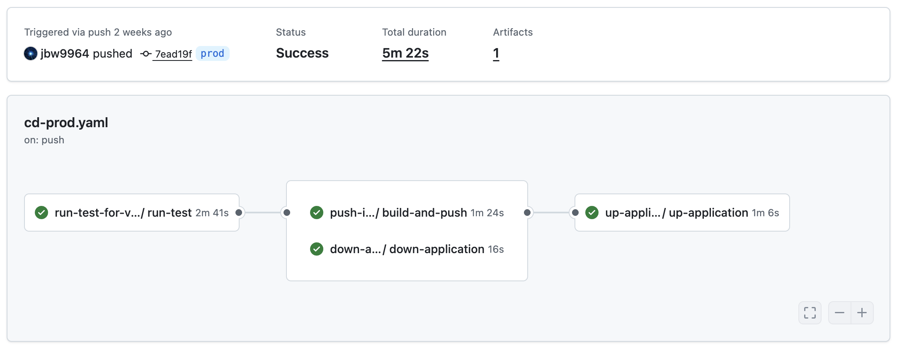

- ### Infra

| 작업                       | 설명                                                                                                                              |
|--------------------------|---------------------------------------------------------------------------------------------------------------------------------|
| Stage, Prod 인프라 구성       | 테스트용 서버 Stage 와 서비스용 서버 Prod 를 구성하였습니다.                                                                                         |
| 도메인 연결, Nginx & HTTPS 구성 | Prod 서버에 도메인은 연결하고 Nginx 를 이용해 HTTPS 를 구성하였습니다. A record 로 서버 탄력 IP 를 맵핑하였으며 Certbot 프로그램을 통해 TLS 인증서 적용, 만료 시 재발급 하도록 구성하였습니다. |
| NAT instance 구성          | Private 서브넷에 인터넷을 공급하기 위해 Bastion Host 에 NAT 기능을 추가하였습니다. `iptables` 패킷 포워딩을 이용하였습니다.                                           |

- ### 기타

| 작업            | 설명                                                                                 | 관련 코드                                                                                                                                                                                                                                                                   |
|---------------|------------------------------------------------------------------------------------|-------------------------------------------------------------------------------------------------------------------------------------------------------------------------------------------------------------------------------------------------------------------------|
| 요청 ID 생성 및 로깅 | 사용자 요청별 ID 를 생성해 로그에 포함시키는 기능입니다. MDC 와 Spring Boot 의 `logging.level` 속성을 이용하였습니다. | [`RequestIdConfigurer`](./src/main/java/org/leisureup/global/config/RequestIdConfigurer.java), [`RequestAndTraceIdDecorator`](./src/main/java/org/leisureup/global/config/RequestAndTraceIdDecorator.java), [`application.yaml`](./src/main/resources/application.yaml) |
| Discord 에러 알림 | 서버 에러 발생시 디스코드 알림을 발송하는 기능입니다. 디스코드의 웹훅 기능과 Logback 의 `AsyncAppender` 를 이용했습니다.    | [`discord-appender.xml`](./src/main/resources/logback/appender/discord-appender.xml), [`discord-error-logger.xml`](./src/main/resources/logback/logger/discord-error-logger.xml),                                                                                       |

---

## ✅ 특히 신경쓴 작업

### 1️⃣ 외부 API 최적화 : OpenFeign 과 비동기

단기 예보 조회 기능 응답이 매우 느린 문제를 발견했고, 문제의 근본 원인은 `기상청 API 응답` 이 느리기 때문임을 확인했습니다.

이를 극복하기 위해 `기상청 API 요청` 을 N 개로 분할하였고, 이들을 비동기 형태로 요청, 조합하는 형태로 구조를 전환하였습니다.

- 관련 코드
    - 단기 예보 조회 : [`ShortTermForecastComposer`](./src/main/java/org/leisureup/info/weather/service/ShortTermForecastComposer.java)

- 관련 기록
    - [[Troubleshooting] - 다사다난했던 기상청 단기 예보 적용기](https://velog.io/@jbw9964/Troubleshooting-%ED%99%94%EA%B0%80%EB%82%98%EC%84%9C-%EC%A0%81%EC%96%B4%EB%B3%B4%EB%8A%94-%EA%B8%B0%EC%83%81%EC%B2%AD-%EB%8B%A8%EA%B8%B0-%EC%98%88%EB%B3%B4-%EC%A0%81%EC%9A%A9%EA%B8%B0)

### 2️⃣ 인프라 비용 감축 : NAT instance 도입

개발 초기 Private 서브넷에서 외부 API 호출을 위해 AWS NAT Gateway 를 사용했습니다.

하지만 NAT Gateway 비용이 생각보다 크다는 문제가 있었고, 이를 해결하고자 Bastion Host 에 iptables 기반 패킷 포워딩을 활성, NAT 기능을 추가했습니다.

### 3️⃣ 로깅 프로필 구성 : Logback 과 Spring Profile

운영 중 발생하는 에러를 빠르게 확인하고 추적하기 위해 로그 프로필을 분리했습니다.

Spring Profile 기반으로 필요한 로거만 선택적으로 탈부착이 가능토록 구성했습니다.

- 관련 코드
    - 디스코드 에러 로거 : [`discord-error-logger.xml`](./src/main/resources/logback/logger/discord-error-logger.xml)

- 관련 기록
    - [[Spring Boot] - Logback 설정 없이 요청마다 ID 를 남겨 로깅해보자](https://velog.io/@jbw9964/Spring-Boot-Logback-%EC%84%A4%EC%A0%95-%EC%97%86%EC%9D%B4-%EC%9A%94%EC%B2%AD%EB%A7%88%EB%8B%A4-ID-%EB%A5%BC-%EB%82%A8%EA%B2%A8-%EB%A1%9C%EA%B9%85%ED%95%B4%EB%B3%B4%EC%9E%90)
    - [[Logback] - Spring profile 로 탈부착이 가능한 file-logger 와 discord-logger 를 만들어보자](https://velog.io/@jbw9964/Logback-Spring-profile-%EB%A1%9C-%ED%83%88%EB%B6%80%EC%B0%A9%EC%9D%B4-%EA%B0%80%EB%8A%A5%ED%95%9C-file-logger-%EC%99%80-discord-logger-%EB%A5%BC-%EB%A7%8C%EB%93%A4%EC%96%B4%EB%B3%B4%EC%9E%90)

---
